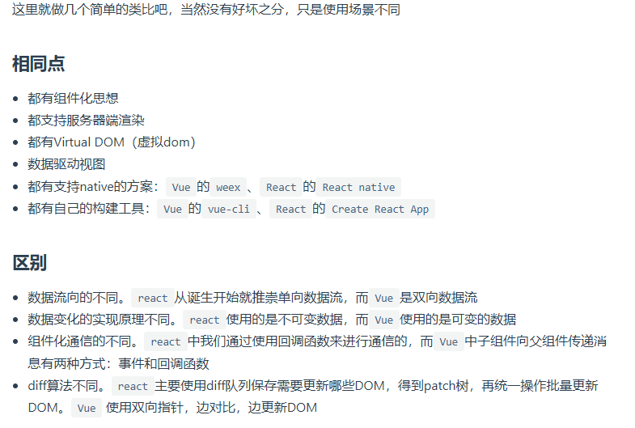

---
# https://vitepress.dev/reference/default-theme-home-page
layout: doc
title: "黑眼圈网路科技公司"
---

# 黑眼圈网路科技公司

## 1、`var` 、 `let` 和 `const` 区别

[详细解释](https://vue3js.cn/interview/es6/var_let_const.html#%E5%9B%9B%E3%80%81%E5%8C%BA%E5%88%AB)

### var、let、const三者区别可以围绕下面五点展开

变量提升
暂时性死区
块级作用域
重复声明
修改声明的变量
使用

### 变量提升

var声明的变量存在变量提升，即变量可以在声明之前调用，值为undefined

let和const不存在变量提升，即它们所声明的变量一定要在声明后使用，否则报错

```js
// var
console.log(a)  // undefined
var a = 10

// let
console.log(b)  // Cannot access 'b' before initialization
let b = 10

// const
console.log(c)  // Cannot access 'c' before initialization
const c = 10
```

### 暂时性死区

var不存在暂时性死区

let和const存在暂时性死区，只有等到声明变量的那一行代码出现，才可以获取和使用该变量

```js
// var
console.log(a)  // undefined
var a = 10

// let
console.log(b)  // Cannot access 'b' before initialization
let b = 10

// const
console.log(c)  // Cannot access 'c' before initialization
const c = 10
```

### 块级作用域

var不存在块级作用域

let和const存在块级作用域

```js
// var
{
    var a = 20
}
console.log(a)  // 20

// let
{
    let b = 20
}
console.log(b)  // Uncaught ReferenceError: b is not defined

// const
{
    const c = 20
}
console.log(c)  // Uncaught ReferenceError: c is not defined
```

### 重复声明

var允许重复声明变量

let和const在同一作用域不允许重复声明变量

```js
// var
var a = 10
var a = 20 // 20

// let
let b = 10
let b = 20 // Identifier 'b' has already been declared

// const
const c = 10
const c = 20 // Identifier 'c' has already been declared
```

### 修改声明的变量

var和let可以

const声明一个只读的常量。一旦声明，常量的值就不能改变

```js

// var
var a = 10
a = 20
console.log(a)  // 20

//let
let b = 10
b = 20
console.log(b)  // 20

// const
const c = 10
c = 20
console.log(c) // Uncaught TypeError: Assignment to constant variable
```

```js
function foo() {
  var a = 0;
  console.log(a);
}

var a = 1;
foo();

const obj = {
  a: 2,
  foo: foo
};

obj.foo();

const o = new foo();
// 0 0 0
```

### 使用

能用const的情况尽量使用const，其他情况下大多数使用let，避免使用var

## 2、React和Vue的区别

[详细解释](https://vue3js.cn/interview/vue/vue.html#%E4%BA%94%E3%80%81vue%E5%92%8Creact%E5%AF%B9%E6%AF%94)


## 3、this指向问题，实际应用

[详细解释](https://vue3js.cn/interview/JavaScript/this.html#%E4%B8%80%E3%80%81%E5%AE%9A%E4%B9%89)

## 4、ES6新特性概括

---
